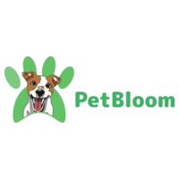

# PetBloom



PetBloom is a study landing page optimized for SEO and PWA, created for a fictional company that sells pet products and services with a focus on animal well-being. The page promotes eco-friendly accessories, services like grooming and bathing, and offers an installable experience on mobile devices.

## 📋 Description

PetBloom is a solution for small pet care businesses looking to enhance their online presence. With optimized SEO, the page helps attract local customers (e.g., "best pet accessories in [city]"), and PWA support allows users to access the catalog offline or install the site as an app.

## ✨ Features

- Responsive design for desktops and mobile devices.
- SEO optimized with meta tags, headers, and compressed images.
- PWA support (installable and works offline).
- Integrated contact form (functional with EmailJS).
- Sections: Home, About, Products, Services, Testimonials, and Contact.

## 🛠 Technologies Used

- HTML5, CSS3, JavaScript
- Tailwind CSS (for styling)
- Workbox (for PWA)
- Google Lighthouse (for optimization)

## 🚀 How to Run the Project Locally

1. Clone the repository:
   ```bash
   git clone https://github.com/HenriMattos/petbloom.git
